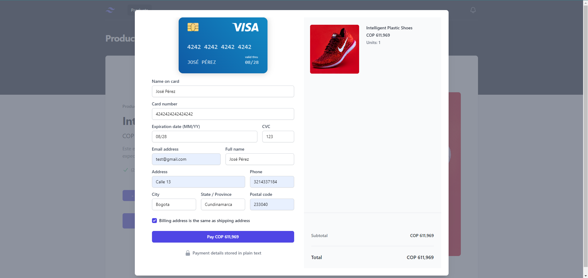

# Frontend Developer Challenge

## Project Structure
The project structure has been set up for you. Below is an overview of the folders and their purposes:

[preview online](https://audiotranscription.cc/products)

```
├───public
└───src
    ├───assets
    ├───layout
    ├───lib
    │   ├───Product
    │   │   ├───application
    │   │   ├───domain
    │   │   │   ├───entity
    │   │   │   └───ports
    │   │   │       ├───inbound
    │   │   │       └───outbound
    │   │   └───infrastructure
    │   └───Transaction
    │       ├───application
    │       ├───domain
    │       │   ├───entity
    │       │   └───ports
    │       │       ├───inbound
    │       │       └───outbound
    │       └───infrastructure
    ├───products
    │   ├───components
    │   └───models
    ├───router
    ├───shared
    │   └───axios
    ├───store
    ├───styles
    ├───transaction
    │   ├───components
    │   └───models
    └───view
```

## Folder Explanation

- **public**: Contains static assets like `index.html`.
- **src**: Main source folder.
    - **assets**: Contains images, fonts, and other static assets.
    - **layout**: Contains layout components for the application.
    - **lib**: Contains library code and modules.
        - **Product**: Contains product-related code.
            - **application**: Application layer for product-related services.
            - **domain**: Domain layer for product-related logic.
                - **entity**: Domain entities for products.
                - **ports**: Interfaces for product-related communication.
                    - **inbound**: Inbound ports for product-related use cases.
                    - **outbound**: Outbound ports for product-related use cases.
            - **infrastructure**: Infrastructure layer for product-related persistence.
        - **Transaction**: Contains transaction-related code.
            - **application**: Application layer for transaction-related services.
            - **domain**: Domain layer for transaction-related logic.
                - **entity**: Domain entities for transactions.
                - **ports**: Interfaces for transaction-related communication.
                    - **inbound**: Inbound ports for transaction-related use cases.
                    - **outbound**: Outbound ports for transaction-related use cases.
            - **infrastructure**: Infrastructure layer for transaction-related persistence.
    - **products**: Contains product-related components and models.
        - **components**: UI components for products.
        - **models**: Data models for products.
    - **router**: Contains routing configurations.
    - **shared**: Contains shared utilities and modules.
        - **axios**: Axios configurations and instances.
    - **store**: Contains state management (Redux or Vuex) configurations.
    - **styles**: Contains global and component-specific styles.
    - **transaction**: Contains transaction-related components and models.
        - **components**: UI components for transactions.
        - **models**: Data models for transactions.
    - **view**: Contains view components for different pages.

## Installation

1. Clone the repository:
```sh
git clone https://github.com/Allrivenjs/nestjs-hexagonal-frontend.git
```
2. Navigate to the project directory:
```sh 
cd nestjs-hexagonal-frontend
```
3. Install dependencies:
```sh 
npm install 
```
4.Create a `.env` file in the root directory and add the following environment variables:
```sh 
cp .env.example .env
```
5. Start the development server:
```bash 
  npm run dev
```

## Screenshots

### Products Page


### Product Details Page


### Transactions Page



### Resume Page

